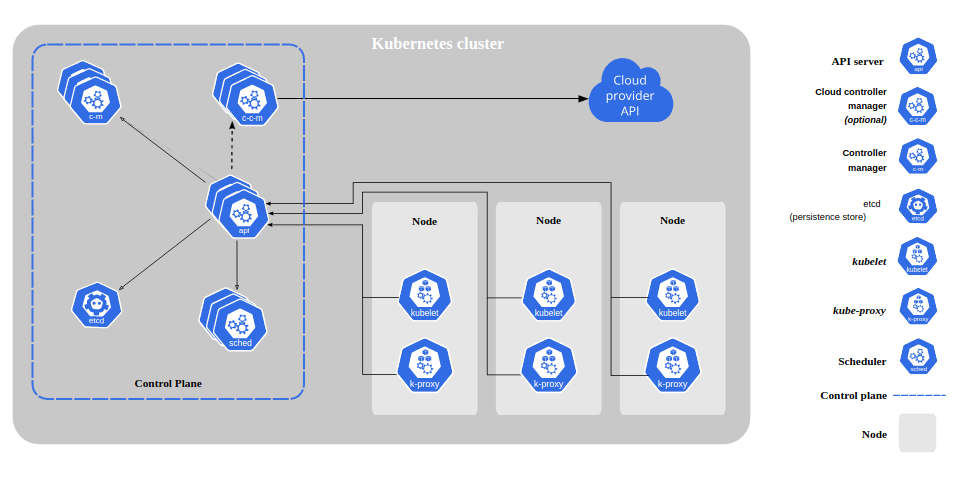
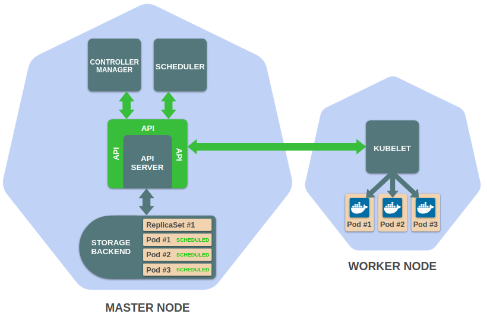

# Notas - Kubernetes

Esse doc tem a intenção de ser um registro para anotações relacionadas a conceitos do kubernetes.

Aqui documentarei procedimentos, definições e quaisquer observações que, durante meu trabalho com a tecnologia, for achando relevante para o seu aprendizado.

## Ciclo para a criação de um recurso no cluster

O Cluster kubernetes é baseado em alguns componentes, serviços que desempenham o papel de gerenciar e orquestrar os recursos e abstrações providos pela ferramenta.

### Componentes

Os componentes podem ser divididos em:

- Control plane
  
    Estarão presentes em nodes com a personalidade de controllers. Tem como objetivo gerenciar os demais nodes e os recursos do cluster.

    Dentre eles, temos:

    - apiserver

        Sua função é expor a API do k8s, sendo assim, ele será o ponto de entrada para as requisições que serão enviadas ao cluster. Por esse motivo irá orquestrar todo o funcionamento e comunicação dos demais componentes.

    - scheduler

        Seu nome vem da atribuição que o mesmo tem para alocar os recursos criados no cluster. Ele irá avaliar a capacidade, pela perspectiva da distribuição de recursos (aqui falamos de memória, CPU e até balanceamento) e responsabilizar o respectivo kubelet (citaremos mais abaixo) do node escolhido para realizar o trabalho e criar o recurso do kubernetes requisitado.

    - controller-manager

        Ele executará o loop principal do cluster. Esse loop scaneará o cluster de maneira a identificar jobs, nodes (se estão ok ou se cairam), pods, abstrações como Services, Deployments e Daemonsets...

    - etcd

        É o banco de dados do kubernetes. Armazenará informações a respeito dos recursos no cluster, o estado de cada um deles, se ainda estão presentes, se foram terminados... É o ponto de consulta dos componentes do cluster

    

- Node
  
    São componentes que estarão presentes ewm todos os nodes, independentemente da sua personalidade.

    O principal componente desse tipo será o 

    - kubelet

        É o worker do kubernetes. Ele quem vai criar efetivamente os recursos em cada node, mediante designação pelo scheduler.

Agora que temos uma breve descrição de cada compoonente, poderemos explicitar como um recurso é criado no kubernetes, desde a sua requisição até o início do seu funcionamento.

Imaginemos a criação de um deployment:

    Ao requisitar a criação de um deployment, o API Server é acionado e salva no etcd o registro do objeto no cluster. A resposta então do API Server será um OK - Deployment aplicado - mas no fundo ainda há trabalhos a serem feitos.
    O controller manager tem a função de gerenciar o loop desses múltiplos controllers que atuarão no cluster. O Deployment criado será um deles.
    Ao requisitar o API Server por novos controllers, o controller manager notará a criação do Deployment e seguirá a especificação (Resource Spec) do mesmo para configuração do recurso.
    Nesse estágio a estrutura dos recursos criados estará toda setada, mas ainda não aplicada a nenhum dos nós do cluster. Nesse momento aparece o scheduler, que será acionado para avaliar que node deverá arcar com essa responsabilidade e, uma vez isso feito, irá atrelar essa informação ao etcd, via API-Server.
    O Scheduler acionará o kubelet respectivo ao node determinado para que finalmente aplique os recursos em sua infra-estrutura, ao hardware por si só e só então o Deployment terá os seus pods rodando com sucesso. 
    Nota: o Apiserver é o único componente que se comunicará com o etcd, logo, todas as informações que deverão ser atualizadas no banco do cluster passarão por ele e então serão encaminhadas ao etcd.

## Comunicação e acesso

Os pods podem se comunicar um com o outro. A configuração de rede por trás dos panos no k8s permite isso. Se pensarmos que cada pod irá possuir um endereço de IP, que existem aplicações que podem se comunicar com eles, o gerenciamento desses endereços pode ser bem complexo. Para facilitar esse trabalho, surge o conceito de Service. Um recurso do tipo Service no cluster k8s nada mais é que um ÚNICO endereço estável para um ou mais pods (imaginando a possibilidade de réplicas). Uma vez que um Service é criado, o CoreDNS (o server DNS do cluster) irá se encarregar de atribuir nomes a esses endereços de IP. Existem alguns tipos de Service, cada um deles com suas particularidades:

	- ClusterIP

		IP alocado (pelo kube-proxy) para cada pod no cluster. Acessível somente internamente no cluster. Para clientes externos o ClusterIP é inacessível.

	- NodePort

		Servidores externos ao cluster terão acesso (provavelmente) ao IP do node. O NodePort é um serviço do k8s que configura uma porta específica do Node para que ela atue especificamente como _access point_ para um determinado pod, ou recurso. 

	- LoadBalancer

		Serviço provido por código third party, normalmente um cloud provider. O k8s, rodando em uma plataforma desses distribuidores, poderá prover um LoadBalancer, que será basicamente o endereço para onde todos os requests para um recurso específico serão enviados. A partir daí o próprio serviço designa cada requisição a uma réplica, segundo algum algoritmo.

	- ExternalName

		Serviço para um caso particular em que o nome do serviço pode ser alterado e desejamos que os serviços externos mantenham comunicação com esse recurso. Nada mais é que um nome estático ao mundo externo que identifique um determinado recurso no cluster.

Podemos associar os serviços acima se organizando um acima do outro, veja:
    
1. ClusterIP (IP interno)
2. NodePort(porta com a qual serviços externos se comunicarão - distribuirá os requests para um determinado ClusterIP)
3. LoadBalancer (vai balancear os requests a serem enviados a cada NodePort)
4. O Service também tem a responsabilidade de atribuir um endereço DNS ao Service IP.
   
   Headless Service: Service em que o clusterIP é setado para None. Nesses casos, os requests para o IP desse serviço não serão intermediados pelo kube-proxy, "o request vai direto ao pod".

## Kubernetes Network Model

O k8s por padrão já estabelece configurações de rede. Inicialmente, todos se comunicam com todos. Não existem protocolos adicionais, o que muitas vezes pode representar uma desvantagem para determinadas soluções.
Para resolver essa questão podemos adotar aplicações third-party para configuração de rede (kubenet, Calico, etc...), os chamados CNIs (Container Network Interface).
O kube-proxy não deve atrapalhar, a menos que seja necessário uma performance state-of-the-art.

CNI: Container Network Implementation.

- Aloca endereços de IP
- Adiciona uma interface de rede
- Configura as interfaces
- As políticas a serem adotadas pela rede do cluster (Network Policies) influenciarão a escolha da CNI a ser usada.

## Daemonsets

- sobem uma imagem por node
- caso um node seja adicionado, a imagem é copiada para la e uma nova instância é criada
- caso um node seja deletado, a instância é transportada para outro node, fazendo com que este fique com duas instâncias
- São úteis para processos que almejam rodar no cluster como um todo, ou em processos per-node
- Podem ser restritos a rodar em APENAS ALGUNS DOS NODES (através de labels e selectors).
- A CLI não possui um comando específico para criação de Daemonsets, assim como vários recursos. Podem ser criados a partir do 'kubectl apply'.

## Selectors

- São as verdadeiras "colas" entre recursos no cluster
- Um Service identificará os recursos que está representando pelo label equivalente ao selector determinado nele.
- Alguns comandos criam labels automaticamente
- Caso esse selector seja editado ou removido, o comportamento natural do service respectivo será considerar que o recurso foi deletado e, se assim configurado, irá criar uma nova instância do recurso.
- Complex selectors
	
    Em alguns momentos queremos ser mais específicos quanto aos pods selecionados para alguma operação.
	Podemos por exemplo adicionar labels (pares chave-valor) com um "comma" (','). Essa representação indicará um AND lógico ao selector no comando.
	
    Lembrando que ao editar os labels dos pods, deveremos editar também o selector no service respectivo.
	kubectl label _resource_ -l _label to select label to add_
	
    Na criação de um novo recurso por causa de um label mismatch, lembre-se que o recurso será criado assim como especificado no YAML original. 

- Se em algum comando especificarmos apenas a key do label como selector isso indicará que estamos procurando apenas pela existência do label no recurso.

## Rolling Updates

Como fazer o update de algum recurso no nosso cluster, de forma progressiva.
Garante availability, se algo der errado no update podemos tratá-los sem prejudicar todas as replicas.
Opções para determinar o pace para o update:

	- maxUnavailable: o número máximo de pods INdisponíveis durante uma operação de rolling update (útil para manter disponibilidade)

	- maxSurge: o número máximo de pods A MAIS do que o número de replicas determinado pelo ReplicaSet durante a operação de rolling update (útil quando estamos instanciando imagens intensivas, que usem muito recurso. Com a limitação conseguimos manter a performance do cluster mesmo durante um container)

e a partir desses dois parâmetros poderemos estipular o ritmo de atualização do recurso no nosso cluster (Obs: geralmente esses valores baseiam-se em uma porcentagem dos pods em execução)
Só podem ocorrer em 

- Deployments
- Daemonsets
- Statefulsets

Através do comando 'kubectl rollout undo' poderemos voltar atrás do último estado do recurso (um dos acima listados) - o comando fica "flipando" com o rollout atual e o rollback respectivo, não conseguimos desfazer seguidos rollouts. 

Como lidar com versões antigas de replicasets? 
	- a situação em um CI/CD, ou com um git ops, num ambiente de produção, vai ficando cada vez mais difícil de ser referenciada. Muitas vezes essas versões podem submeter a hashes, ou commit IDs (pensando em um versionamento), ou serem baseadas em fatores muito difíceis de serem memorizados.
	- o comando 'kubectl rollout history' nos dá um histórico de replicasets e versões respectivas, a partir do parâmetro REVISION 
	- A abstração acima do ReplicaSet (uma das 3 mencionadas acima), irá armazenar o estado de cada REVISION na sua seção Annotations. A partir daí poderemos usufruir a flag '--to-revision' e retomar o rollout respectivo do recurso.

Qual a diferença entre aplicar um patch ao recurso ou editá-lo com 'kubectl edit'?
	Aparentemente nenhum, são similares. Mais uma vez, a vantagem de armazenar isso em um arquivo yaml seria o maior controle do que estamos fazendo e manteríamos a reprodutibilidade do estado do recurso.

## Healthchecks

Referenciarão um container por vez. Se aplicam ao CONTAINER e não ao POD.

3 "probes" opcionais:
    - liveness: checa se o container está live
    - readiness: checa se o container está apto a receber dados (estabelecer uma conexão)
    - startup: checa se o container ainda esta iniciando
Não substitui uma ferramenta de monitoramento, apenas auxilia o usuario a saber se o container está com o comportamento esperado.
O parâmetro 'RestartPolicy' indica como proceder no caso do LIVENESS "probe" (que nada mais são do que testes) falhar.
    - Never: o container não é reiniciado
    - OnFailure ou Always: reinicia o container em caso de falha
Startup Probe
    A partir da versão 1.16 do k8s surge a opção de um probe para testar especificamente o startup do container.
    Os demais probes só começarão a ser efetuados quando este proceder com sucesso.
Os probes são uma solução do kubernetes para indicar ao cluster se o container está OK ou há algum problema, alguns processos do k8s, como rolling updates por exemplo, dependem do bom estado dos containers envolvidos.
Caso eles não sejam postos em prática, o cluster interpretará que os containers sempre estarão saudáveis.
Devemos nos atentar ao fato de que probe estamos observando para checar se há algum problema. Pensando em uma aplicação que deve se conectar a um banco de dados:
    Se a conexão não for bem sucedida:
        - O liveness probe irá ser bem sucedido
        - O readiness probe irá falhar
    Isso se dá para evitar com que ocorram problemas em cascata com as aplicações, por exemplo, quando um banco for usado para manutenção a aplicação não necessariamente sai do ar.
    Essa regra valerá para quaisquer dependências.
*Obs: processos zumbis em containers e probes (PESQUISAR). [Zombie Reaping]

## Configurando aplicações num cluster k8s

Podemos aplicar essas configurações em aplicações do nosso cluster via:

- command line arguments
- variáveis de ambiente
- arquivos de configuração

Antes do kubernetes essas configurações eram aplicadas manualmente, via scripts ou comandos manuais.

Downward API: permite com que especifiquemos variáveis de ambiente baseadas nos dados do próprio pod ou container.
	Ex: 'valueFrom:'/'fieldRef:'/'fieldPath:'

*ConfigMaps*

		Permite armazenar certas configurações a serem aplicadas no cluster.
		Um arquivo chave-valor com extensão '.conf' pode ser usado como base para a geração do recurso.

		A criação do recurso recebe como parâmetro um conjunto de chave-valor também.
		
        A vantagem do seu uso é o armazenamento dentro do cluster, podendo ser anexado aos recursos apropriados.
		Devemos criar um 'volume' na especificação do recurso para que ele possa acessar o configMap, além disso a própria referência ao ConfigMap, pelo nome, deverá ser especificada.

## Ingress

Anteriormente vimos configurações como o NodePort e a abstração de um Service para expor pods internos do cluster a usuários externos.
Relacionando essa prática com serviços HTTP, podemos pensar em uma espécie de "proxy reverso" para intermediar essa comunicação e agir como um "redirecionador" ou até como um LoadBalancer.

O Ingress é um recurso built-in do k8s específico para requests HTTP/S. Lida com conexões "de fora para dentro" do cluster.

As features básicas que esse tipo de recurso habilita seriam:
  - load balancing
  - SSL
  - Roteamento baseado em DNS, segundo o nome (por exemplo, de acordo com o nome especificado o ingress irá identificar que pod deverá ser acionado)
O Ingress pode ser usado de forma que toda a organização do seu cluster se volte a sua especifica composição (os requests aos pods do cluster passarão por ele).

A sua solução como um todo será composta de algumas partes

1. Ingress controller
 
    Diferentemente dos controllers de recursos como o Deployment Controller ou o ReplicaSet Controller, o Ingress controller não é um recurso built-in do k8s e deverá ser manualmente instalado e gerenciado.
    Assim sendo esse componente agirá de forma semelhante ao 'controller manager' built-in do k8s mas responsável pelos controllers do recurso Ingress.
    Basicamente, ele vai rodar um loop onde identificará todos os recusrsos Ingress e atualizará o cluster para que o acesso seja concedido.  

2. DNS
 
    Muitas vezes, quando for necessário algum tipo de DNS externo para acesso aos recursos do cluster (quando usuários externos poderão usar nomes para enviar requests a pods do cluster, via Ingress).

3. Criação de recursos Ingress

    1 por serviço que deverão receber requests externos ao cluster
    O Ingress controller será o responsável por encontrar esses recursos e configurar o Load Balancer para tais.

Uma alternativa para o Ingress seria o *hostNetwork*
    
    Configuração específica de um pod.Spec
    Normalmente, cada pod terá o seu próprio network namespace, onde o próprio kubernetes irá setar a rede para que o pod se comunique com os demais recursos do cluster.
    Caso a flag hostNetwork seja True, ou seja, seja acionada, essa auto-configuração não ocorre e a rede usada pelo pod será a própria rede do host, física (não mais virtual).
    Dessa forma, o IP do pod será o IP do próprio host;

O Ingress Controller basicamente tem conhecimento dos endpoints usados pelos serviços expostos. Com isso, ele redireciona o request diretamente para o pod específico, de acordo com o endpoint registrado 
internamente.

É possível que nosso cluster tenham múltiplos Ingress Controllers, mas é bem incomum.

Annotations podem ter um importante papel ao configurar esses controllers. Muito cuidado, pois seu comportamento não é necessariamente exato, como esperamos. E caso algo que possa impactar algum serviço mude no cluster, devemos manualmente checar se as annotations ainda são válidas e, se não for o caso, alterá-las.

## Registries e K8s

- por default não há registries setados no cluster k8s
- para buscar e salvar imagens a serem reproduzidas nos containers do cluster, precisamos salvá-las em um registry

## Fontes

[1] - https://kubernetes.io/docs/concepts/overview/components/
[2] Kubernetes Mastery: Hands-On Lessons From A Docker Captain - https://www.udemy.com/course/kubernetesmastery/
